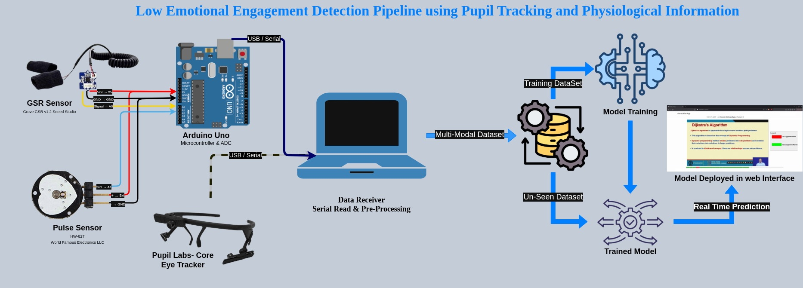

# Low_Emotional_Engagement_Detection

# Multimodal Video Annotation & Pupil Labs Pipeline

A step‑by‑step guide to install, run, and reproduce the full pipeline (React frontend + Python backend) for video playback/annotation, multimodal data capture (serial sensors), and analysis.

> **Note:** You must have **Pupil Capture** and **Pupil Player** pre‑installed on your system before using this pipeline.

Repository: [Low Emotional Engagement Detection](https://github.com/ron-desa/Low_Emotional_Engagement_Detection)

---

## Table of Contents

1. [What this project does](#what-this-project-does)
2. [Prerequisites](#prerequisites)
3. [Quickstart (TL;DR)](#quickstart-tldr)
4. [Directory Structure](#directory-structure)
5. [Installation](#installation)
6. [Configuration](#configuration)
7. [Running the System](#running-the-system)
8. [Using Pupil Capture & Player](#using-pupil-capture--player)
9. [Data Flow & Outputs](#data-flow--outputs)
10. [Analysis Toolkit](#analysis-toolkit)
11. [Troubleshooting](#troubleshooting)
12. [Acknowledgements](#acknowledgements)

---

## What this project does

* **Frontend (React):**

  * Play videos with `react-player`.
  * UI for **user selection**, **annotations/labels**, and **CSV export**.
  * Optional media recording via `react-media-recorder`.
* **Backend (Python/Flask):**

  * Reads **sensor streams** (e.g., heart rate / GSR) via `pyserial`.
  * Provides **APIs** to store/serve data (`flask`, `flask-cors`, `pyzmq`).
  * Coordinates with **Pupil Capture** (ZeroMQ / Network API) and performs **time sync**.
* **Analysis (Python):**

  * Data wrangling with `pandas`, `numpy`.
  * Change detection with `densratio` (relative density ratio).
  * Plotting with `matplotlib`.

> The stack is **hybrid**: React (Node.js) for UI + Python for capture/processing.

---

## System Pipeline Diagram

<p align="center">
  
</p>

<p align="center">
  <em>Low Emotional Engagement Detection Pipeline using Pupil Tracking and Physiological Signals</em>
</p>

## Flow Diagram of the Project
```bash
┌──────────────────────────────┐      ┌──────────────────────────────┐      ┌──────────────────────────────┐
│   Pupil Capture (Eye Data)   │      │  Physiological Sensors       │      │    Annotation App (User)     │
│------------------------------│      │  (Arduino-based Device)      │      │------------------------------│
│ • Gaze position (x, y)       │      │ • Heart Rate (HR)            │      │ • Valence ratings            │
│ • Blink, pupil diameter      │      │ • Galvanic Skin Response     │      │ • Arousal ratings            │
│ • Sampling rate ≈ 250 Hz     │      │ • Sampling rate ≈ 10 Hz      │      │ • Time-stamped user input    │
└──────────────┬───────────────┘      └──────────────┬───────────────┘      └──────────────┬───────────────┘
               │                                      │                                      │
               └──────────────────────┬───────────────┴───────────────┬──────────────────────┘
                                      ▼                               ▼
                             ┌────────────────────────────────────────────────────┐
                             │       Data Synchronization & Fusion Layer          │
                             │----------------------------------------------------│
                             │ • Aligns timestamps from all three sources         │
                             │ • Handles frequency mismatch & latency correction  │
                             │ • Produces unified multimodal dataset (CSV/JSON)   │
                             └──────────────────────────┬─────────────────────────┘
                                                        │
                                                        ▼
                                      ┌──────────────────────────────────────────┐
                                      │     Unified Multimodal Dataset (Output)  │
                                      │------------------------------------------│
                                      │ • Synchronized eye, physio, and label data│
                                      │ • Format: CSV or JSON                    │
                                      └───────────────────┬──────────────────────┘
                                                          │
                                                          ▼
                                      ┌──────────────────────────────────────────┐
                                      │     Analysis & Visualization Layer       │
                                      │------------------------------------------│
                                      │ • Emotion inference / engagement metrics │
                                      │ • Visualization via React Frontend       │
                                      │ • Export for downstream modeling         │
                                      └──────────────────────────────────────────┘
```


## Prerequisites

### Software

* **Pupil Capture** and **Pupil Player** (install ahead of time).
* **Python** ≥ 3.9 (3.10 recommended).
* **Node.js** ≥ 18 and **npm** ≥ 9.
* **Git**.
* (Optional) **FFmpeg** if you plan to transcode videos.

### Python packages

Installed via `requirements.txt`:

```
numpy
pandas
matplotlib
scikit-learn
pytz
natsort
densratio
pyautogui
flask
flask-cors
pyserial
pyzmq
```

> Built‑ins like `os`, `glob`, `subprocess`, `time`, `sys`, `datetime`, `json`, `pathlib`, `collections` are part of Python’s standard library (no install needed).

### OS Notes for `pyautogui`

* **macOS:** enable Accessibility (System Settings → Privacy & Security → Accessibility → allow Terminal/IDE).
* **Linux (X11):** ensure you’re on X11 (Wayland needs extra config) and have screenshot utilities available.
* **Windows:** no extra permissions typically required.

---

## Quickstart (TL;DR)

```bash
# 1) Clone
git clone https://github.com/ron-desa/Low_Emotional_Engagement_Detection.git
cd Low_Emotional_Engagement_Detection

# 2) Python env
python -m venv .venv
source .venv/bin/activate   # Windows: .venv\Scripts\activate
pip install -r requirements.txt

# 3) Node deps (from the frontend directory or project root if combined)
npm install

# 4) Config
cp .env.example .env   # edit ports, serial settings, data paths

# 5) Run backend (Flask)
python backend/app.py  # or your backend entrypoint

# 6) Run frontend
npm start
```

Open the app in your browser (usually [http://localhost:3000](http://localhost:3000)). Make sure **Pupil Capture** is running and the **Network API** is enabled.

---

## Directory Structure

A suggested layout (adjust to your repo):

```
Low_Emotional_Engagement_Detection/
├── annotate_app/
│   ├── Annotations/
│   ├── node_modules/
│   ├── public/
│   └── src/
│       ├── assets/
│       └── videos/
├── Data_preprocess/
│   ├── Final_Data_Table/
│   ├── Merge_Eye+Physio/
│   │   └── scrap/
│   ├── plots/
│   └── Preprocess_Signals/
│       ├── 1_input_signals/
│       ├── 2_Normalized_data/
│       ├── 3_Normalized_window_data/
│       ├── 4_Alldata_window/
│       ├── 5_window_annotation/
│       ├── 6_signal_probe/
│       ├── raw_data/
│       └── scores/
├── Images/
│   ├── blured_images/
│   └── Raw_images/
├── ML/
│   ├── Active_Learning/
│   │   ├── 1,2-3,4,5,6-7,8/
│   │   └── 1,2-7,8-7,8/
│   ├── LOSO/
│   ├── LOSO_RF/
│   ├── Personalised/
│   ├── Personalised_RF/
│   └── Re_eval_Al_test_split_median/
│       ├── 2,3,4,5,6-7,8/
│       └── 2-3,4,5,6,7,8/
├── Pupil/
│   ├── new_file/
│   │   └── Learning-git-github/
│   └── __pycache__/
├── Score_Calculation/
│   └── __pycache__/
├── .env.example
├── .gitignore
├── README.md
└── requirements.txt
```

---


